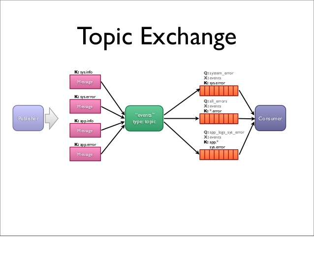

# rabbitmq
The main goal of this project is to explore basic features of Spring AMQP.

_Reference_: https://blogs.vmware.com/vfabric/2013/02/choosing-your-messaging-protocol-amqp-mqtt-or-stomp.html  
_Reference_: https://www.rabbitmq.com/tutorials/amqp-concepts.html

# preface
**RabbitMQ** is an open source message broker software that supports:
* Advanced Message Queuing Protocol (AMQP),
* Streaming Text Oriented Messaging Protocol (STOMP), 
* Message Queuing Telemetry Transport (MQTT).

## AMQP
Two of the most important reasons to use AMQP are reliability and interoperability.
As the name implies, it provides a wide range of features related to:
* messaging, 
* reliable queuing, 
* topic-based publish-and-subscribe messaging, 
* flexible routing, 
* transactions, 
* security. 

AMQP exchanges route messages directly—in fanout form, by topic, and also based on headers.

## STOMP
STOMP (Simple/Streaming Text Oriented Messaging Protocol) is the only one of these three protocols to be text-based, 
making it more analogous to HTTP in terms of how it looks under the covers. Like AMQP, STOMP provides a message 
(or frame) header with properties, and a frame body.

STOMP does not, however, deal in queues and topics—it uses a SEND semantic with a "destination" string. 
The broker must map onto something that it understands internally such as a topic, queue, or exchange. 
Consumers then SUBSCRIBE to those destinations.

## MQTT
The design principles and aims of MQTT are much more simple and focused than those of AMQP — 
it provides publish-and-subscribe messaging (no queues, in spite of the name) and was specifically 
designed for resource-constrained devices and low bandwidth, high latency networks.

It offers three qualities of service: 
* fire-and-forget / unreliable,
* "at least once" to ensure it is sent a minimum of one time (but might be sent more than one time),
* "exactly once".

MQTT’s strengths are:
* simplicity (just five API methods), 
* compact binary packet payload (no message properties, compressed headers, much less verbose than 
something text-based like HTTP),
* good fit for simple push messaging scenarios such as temperature updates, stock price tickers, oil pressure feeds 
or mobile notifications.

# RabbitMQ AMQP
## overview

## exchange

### direct

### topic

### fanout

### header

## queue

http://localhost:15672/#/

http://localhost:8080/customers

http://localhost:8090/customers